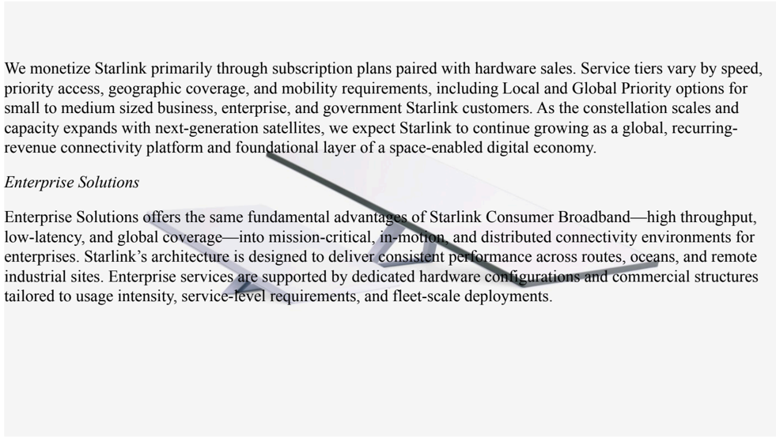

# f055 — Starlink monetization model: subscription tiers and Enterprise Solutions overview

This figure presents a text description of how SpaceX monetizes Starlink through subscription plans paired with hardware sales, including Consumer Broadband and Enterprise Solutions offerings.

The image is a prose page from the SpaceX S-1 describing Starlink's revenue model. The top section explains that service tiers vary by speed, priority access, geographic coverage, and mobility requirements, with Local and Global Priority options for small to medium businesses, enterprise, and government customers. The second section, headed 'Enterprise Solutions,' describes how Starlink delivers consistent performance across routes, oceans, and remote industrial sites via dedicated hardware configurations and commercial structures tailored to usage intensity, service-level requirements, and fleet-scale deployments.

**Entities:** Starlink, SpaceX, Enterprise Solutions, Consumer Broadband, Local Priority, Global Priority, space-enabled digital economy

