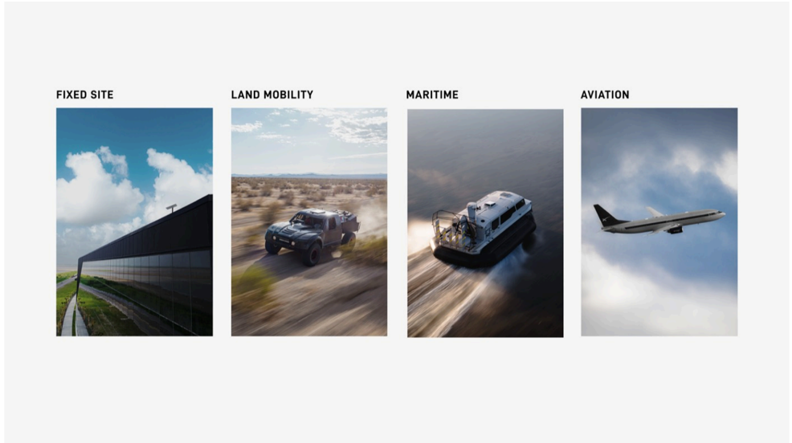

# f056 — Starlink Four Deployment Categories Fixed Site Land Mobility Maritime Aviation

The figure illustrates the four primary Starlink connectivity use-case verticals — Fixed Site, Land Mobility, Maritime, and Aviation — each represented by a corresponding product-in-use photograph.

Four labeled panels display Starlink's market segments: Fixed Site shows a flat-panel antenna array mounted on a large structure; Land Mobility depicts an off-road military-style vehicle in a desert environment; Maritime shows a hovercraft or vessel underway on water; Aviation features a commercial jet aircraft in flight. Together the panels communicate the breadth of Starlink's addressable markets across stationary and mobile environments.

**Entities:** Starlink, SpaceX, Fixed Site, Land Mobility, Maritime, Aviation, Starlink flat-panel antenna, off-road vehicle, hovercraft, commercial aircraft

