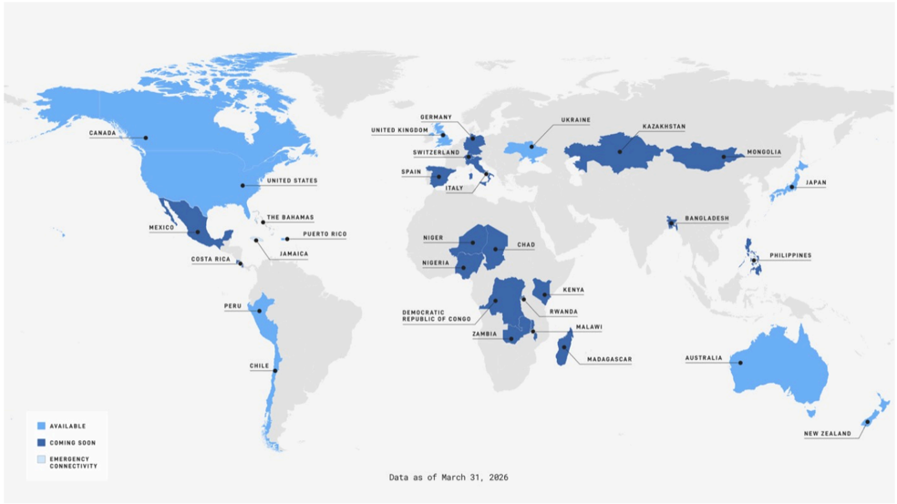

# f058 — Starlink Mobile Coverage Map — Available, Coming Soon, Emergency Connectivity Worldwide

A world map as of March 31, 2026 showing which countries have Starlink mobile service available, coming soon, or as emergency connectivity only, with coverage concentrated in North America, Oceania, Europe, and parts of Africa and Asia.

The map uses three fill colors to categorize countries: light blue for 'Available,' dark blue for 'Coming Soon,' and a third shade for 'Emergency Connectivity.' Available countries include Canada, the United States, Australia, and New Zealand. A large set of labeled countries across Latin America, Europe, Central Asia, sub-Saharan Africa, South Asia, and Southeast Asia are marked Coming Soon. No quantitative axes are present; geographic distribution is the primary encoding.

**Entities:** Starlink, SpaceX, Starlink Mobile, Canada, United States, Mexico, The Bahamas, Puerto Rico, Costa Rica, Jamaica, Peru, Chile, United Kingdom, Germany, Switzerland, Spain, Italy, Ukraine, Kazakhstan, Mongolia, Japan, Niger, Nigeria, Chad, Kenya, Rwanda, Malawi, Zambia, Democratic Republic of Congo, Madagascar, Bangladesh, Philippines, Australia, New Zealand, satellite internet, mobile coverage, emergency connectivity

