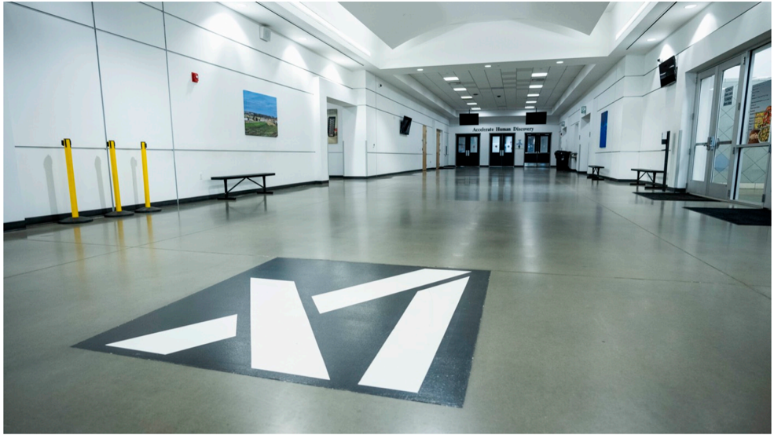

# f059 — SpaceX facility interior hallway with logo floor inlay photo

An interior corridor of what appears to be a SpaceX facility, featuring a large stylized logo inlaid on the floor and a clean, modern hallway leading to glass doors.

The photo depicts the interior of a large modern facility hallway with white walls and recessed ceiling lighting arranged in rows. A prominent stylized angular logo — resembling an abstract chevron or 'M' shape — is inlaid on the polished floor in the foreground. Yellow safety bollards line the left side of the corridor, and a set of glass double doors is visible at the far end. A small framed image or sign is mounted on the left wall in the background.

**Entities:** SpaceX, facility interior, hallway, floor logo, bollards, glass doors

