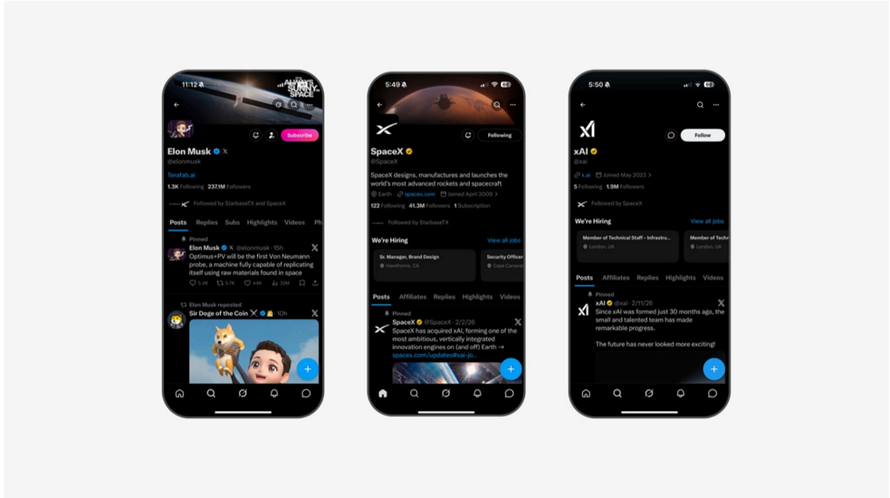

# f060 — Elon Musk, SpaceX, xAI — X profiles showing SpaceX acquires xAI

Three X (formerly Twitter) profile screenshots for Elon Musk, SpaceX, and xAI, with SpaceX's pinned post announcing its acquisition of xAI to form a vertically integrated innovation engine.

The left screen shows Elon Musk's X profile (237M followers) with a pinned post announcing Optimus+PV as the first Von Neumann probe capable of self-replication using raw materials found in space. The center screen shows SpaceX's profile (41.3M followers) with a pinned post stating 'SpaceX has acquired xAI, forming one of the most ambitious, vertically integrated innovation engines on (and off) Earth.' The right screen shows xAI's profile with a pinned post noting that since xAI was founded 30 months ago the small team has made remarkable progress, and a 'We're Hiring' section listing technical staff roles.

| field | value |
|---|---|
| Elon Musk followers | 237M |
| Elon Musk following | 1.3k |
| SpaceX following | 122 |
| SpaceX followers | 41.3M |
| SpaceX subscriptions | 1 |

**Entities:** Elon Musk, SpaceX, xAI, X, Twitter, Optimus+PV, Von Neumann probe, space.com, StarbazePX, Sir Doge of the Coin

