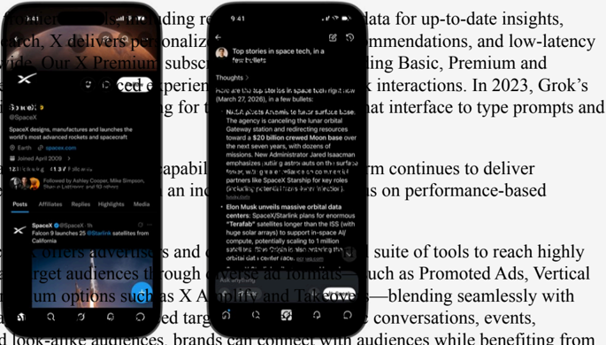

# f061 — X Platform Features: Premium Subscriptions, Grok AI, Promoted Ads Infographic

The figure showcases X's (formerly Twitter) platform capabilities including tiered Premium subscriptions, the Grok AI assistant, and advertising tools such as Promoted Ads, illustrating how X monetizes through subscriptions and brand advertising.

The image shows a composite infographic of the X (formerly Twitter) platform, featuring a mobile app interface screenshot on the left alongside descriptive text panels. The left section highlights X's personalized recommendation engine, low-latency subscriptions (Basic, Premium, Premium+), and the Grok AI assistant introduced in 2023 with a prompt interface. The right section describes X's advertising suite, including Promoted Ads and Vertical formats that blend with user conversations and events, enabling brands to connect with targeted audiences on a performance-based model.

**Entities:** X, Twitter, Grok, Premium, Premium+, Basic, Promoted Ads, Vertical Ads, Elon Musk, 2023

