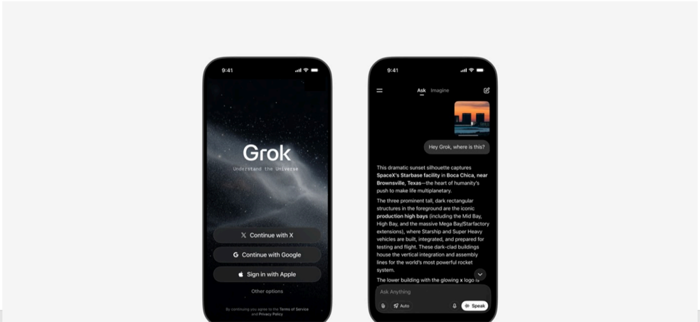

# f062 — Grok AI App iPhone Screenshot — SpaceX Starbase Image Recognition

The figure shows two iPhone screens demonstrating the Grok AI app: a login screen on the left and an image-recognition conversation on the right, where Grok identifies SpaceX's Starbase facility from a sunset photo.

The left phone displays the Grok app splash/login screen with sign-in options via X, Google, and Apple against a dark starfield background. The right phone shows Grok's 'Ask' interface, where a user submitted a sunset photo with the question 'Hey Grok, where is this?' and Grok responded identifying the location as SpaceX's Starbase facility in Boca Chica, near Brownsville, Texas, describing the tall dark rectangular structures as Starship/Super Heavy production high bays including the Mid Bay, High Bay, and Mega Bay/Starfactory extensions. The response text is partially cut off at the bottom of the right screen.

**Entities:** Grok, xAI, X, SpaceX, Starbase, Boca Chica, Brownsville, Texas, Starship, Super Heavy, Mid Bay, High Bay, Mega Bay, Starfactory, Google, Apple, iPhone

