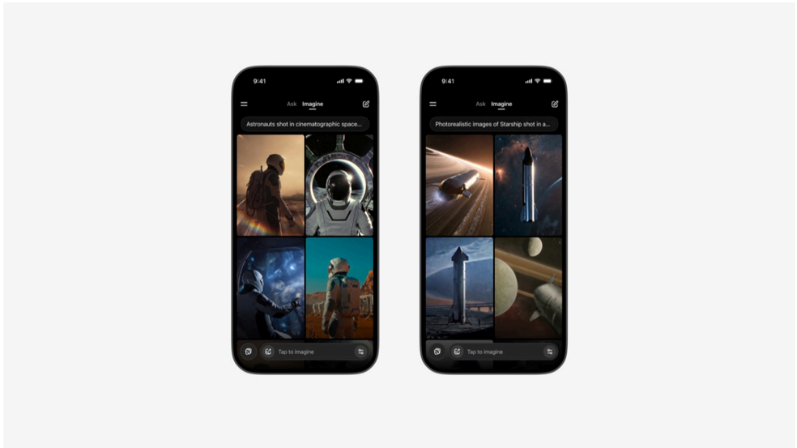

# f063 — Imagine AI Image App Mobile UI — Astronauts & Starship Prompts

Two smartphone screenshots showcase the 'Imagine' tab of an AI-powered mobile app generating cinematic space imagery, demonstrating prompts for astronauts and SpaceX Starship respectively.

Each phone displays a dark-themed mobile interface with 'Ask' and 'Imagine' mode tabs. The left device shows a prompt beginning 'Astronauts shot in cinematic space...' with a 2×2 grid of AI-generated cinematic astronaut and space imagery. The right device shows 'Photorealistic images of Starship shot in a...' with a 2×2 grid of photorealistic Starship rocket renders including launch, orbital, and planetary surface scenes. Both screens show the same UI layout with a 'Tap to Imagine' call-to-action button at the bottom.

**Entities:** Imagine, Ask, Starship, SpaceX, astronauts, AI image generation, mobile app, dark mode UI, Tap to Imagine

