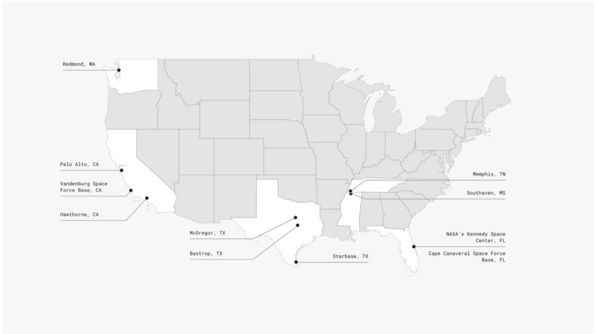

# f064 — SpaceX U.S. Facilities Map — 11 Locations Nationwide

A U.S. map pinpointing SpaceX's domestic facility locations, showing a concentration of sites along the California coast, Texas Gulf region, and Florida's Space Coast.

The figure is a labeled dot map of the contiguous United States identifying 11 SpaceX operational locations. California hosts four sites (Redmond is shown in WA): Palo Alto, Vandenburg Space Force Base, and Hawthorne. Texas hosts three sites: McGregor, Bastrop, and Starbase. Florida hosts two launch-related sites: NASA's Kennedy Space Center and Cape Canaveral Space Force Base. Two southeastern logistics sites appear in Memphis, TN and Southaven, MS. No quantitative axis is present; the map conveys geographic distribution of SpaceX infrastructure.

**Entities:** SpaceX, Redmond WA, Palo Alto CA, Vandenburg Space Force Base CA, Hawthorne CA, McGregor TX, Bastrop TX, Starbase TX, Memphis TN, Southaven MS, NASA Kennedy Space Center FL, Cape Canaveral Space Force Base FL, California, Texas, Florida, Tennessee, Mississippi, Washington

