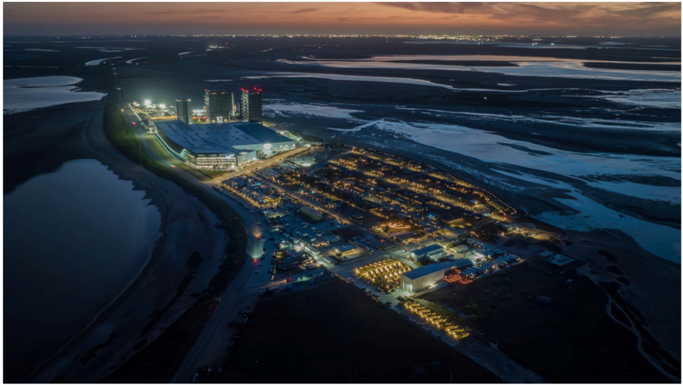

# f065 — SpaceX Starbase facility aerial night photo Boca Chica

Aerial nighttime photograph of SpaceX's Starbase launch facility in Boca Chica, Texas, showing the illuminated complex situated on a coastal peninsula surrounded by wetlands.

The image is a dusk/night aerial photograph looking down at a large industrial launch campus lit with bright artificial lighting against a darkening sky. The facility occupies a narrow coastal strip flanked by water and tidal flats on multiple sides. Tall structures—likely the Starship launch tower and supporting infrastructure—are visible on the left side of the complex bathed in blue-teal lighting. The broader campus extends to the right with numerous lit buildings, roads, and equipment areas.

**Entities:** SpaceX, Starbase, Boca Chica, Texas, Starship, launch tower, orbital launch mount

