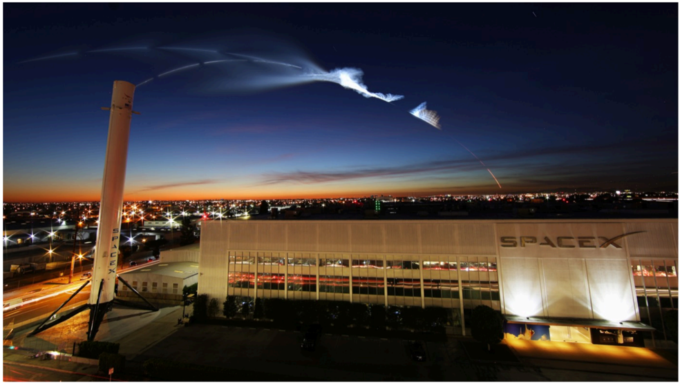

# f066 — SpaceX Hawthorne California headquarters photo rocket contrail at dusk

Twilight photograph of SpaceX's Hawthorne, California factory with a dramatic rocket exhaust plume streaking across the sky overhead, illustrating the company's local launch operations.

The photo shows the exterior of the SpaceX manufacturing facility in Hawthorne, California at dusk, with city lights visible in the background. A bright, broad rocket exhaust contrail arcs across the darkening blue sky above the building. The SpaceX wordmark is visible on the building facade. The image conveys the proximity of SpaceX's headquarters to its launch activities.

**Entities:** SpaceX, Hawthorne, California, rocket contrail, Falcon 9, manufacturing facility, headquarters

