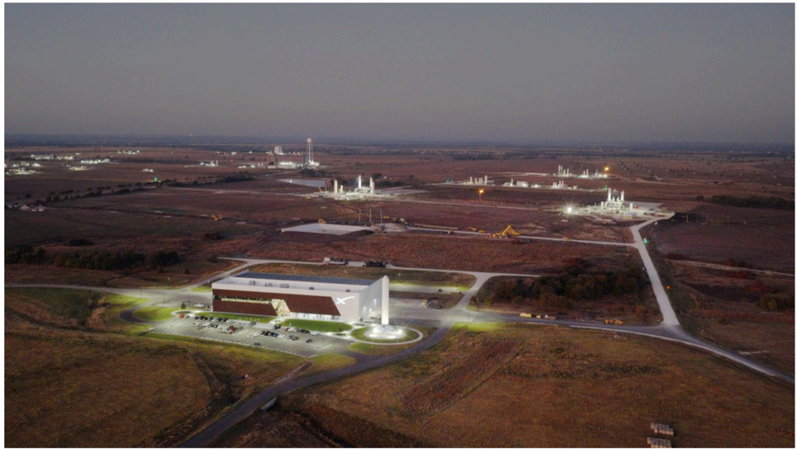

# f067 — SpaceX McGregor Texas Rocket Development and Test Facility aerial photo

Aerial view of SpaceX's rocket development and test facility in McGregor, Texas, showing multiple engine test stands and facility buildings across the site.

The photograph is an aerial/bird's-eye view of SpaceX's McGregor, Texas engine testing complex, taken at dusk or under artificial illumination. The foreground shows large white industrial buildings, likely used for engine processing and manufacturing. The background reveals multiple rocket engine test stands rising above the flat Texas terrain, with what appear to be illuminated or active structures. The landscape surrounding the facility is flat, semi-arid scrubland consistent with central Texas geography.

**Entities:** SpaceX, McGregor, Texas, rocket engine test facility, Rocket Development and Test Facility, engine test stand, central Texas

