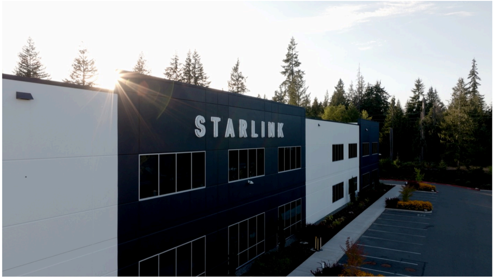

# f068 — Starlink facility exterior building photo

An aerial or elevated exterior photo of a Starlink-branded commercial building, showing the company's facility with its name prominently displayed on the facade.

The image is a photograph of a multi-story commercial/industrial building with 'STARLINK' in large white letters mounted on a dark navy-blue exterior panel. The building features a mix of dark blue and white cladding with rows of windows. Trees line the background, the sun creates a lens flare at the upper left, and a parking lot is visible at lower right.

**Entities:** Starlink, SpaceX, Starlink facility, Starlink headquarters, satellite internet

