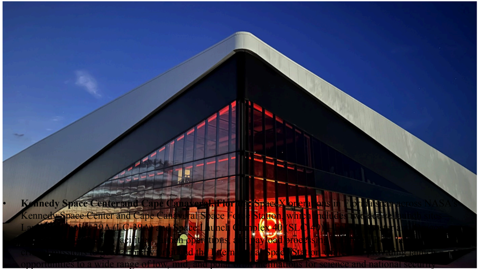

# f069 — SpaceX Cape Canaveral Landing Zone Facility Night Photo

A nighttime exterior photograph of what appears to be a SpaceX facility building at Cape Canaveral, its glass façade illuminated in red, likely associated with Landing Zones 40 and/or 2 used for Falcon booster recovery missions.

The image is a nighttime architectural photograph of a modern building with a dramatically angled roofline and floor-to-ceiling glass curtain wall glowing in red/orange light. No axes, series, or data are present — this is a facility photo rather than a chart. The building's contemporary design and nighttime staging suggest it is a showcase or operational facility at Cape Canaveral. The red illumination may reflect interior lighting or signage.

**Entities:** SpaceX, Cape Canaveral, Landing Zone 40, Landing Zone 2, Falcon booster, booster recovery, Cape Canaveral Space Force Station

