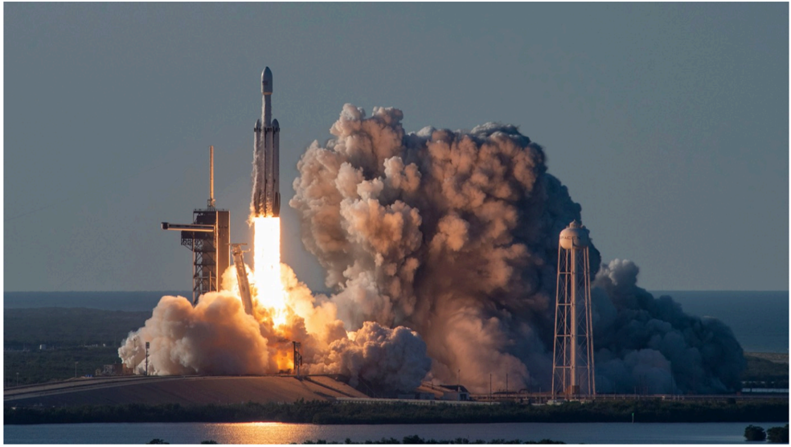

# f070 — SpaceX Falcon Heavy launch at NASA Kennedy Space Center Florida — photo

A SpaceX Falcon Heavy rocket lifts off from NASA's Kennedy Space Center in Florida, producing a massive plume of exhaust, with the launch tower visible at right.

The photograph captures a Falcon Heavy rocket — identifiable by its triple-core booster configuration — mid-launch against a twilight or overcast sky at Kennedy Space Center, Florida. A towering white smoke and steam cloud billows outward from the base of the rocket. The launch mount and service structure are visible to the right. No chart axes or data series are present; the image is a documentary launch photograph included in the SpaceX S-1 filing.

**Entities:** SpaceX, Falcon Heavy, NASA, Kennedy Space Center, Florida, KSC, launch, booster, rocket

