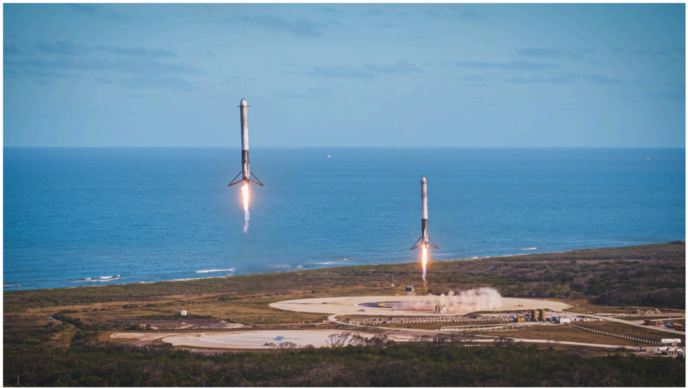

# f071 — Cape Canaveral Space Force Station Florida — dual booster landing photo

Two SpaceX Falcon Heavy side boosters execute a simultaneous propulsive landing at Cape Canaveral Space Force Station, Florida, demonstrating rocket reusability.

The photo captures two Falcon Heavy side-core boosters touching down in parallel on adjacent landing pads at Cape Canaveral Space Force Station with the Atlantic Ocean visible in the background. Each booster's Merlin engines are firing in a landing burn, producing bright exhaust plumes. The synchronized twin landing is a signature milestone of SpaceX's reusable launch vehicle program.

**Entities:** SpaceX, Falcon Heavy, Cape Canaveral Space Force Station, Florida, booster landing, Landing Zone 1, Landing Zone 2, Merlin engine, reusable rocket, Atlantic Ocean

