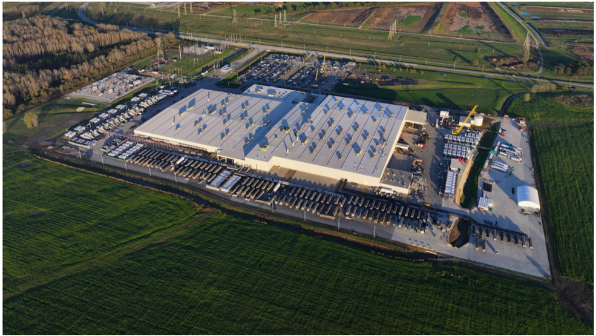

# f073 — Aerial view of large SpaceX manufacturing facility complex

An aerial photograph of a large industrial manufacturing campus surrounded by green fields, featuring a massive flat-roofed building with solar panels and adjacent parking areas.

The image is a drone or aerial photograph showing a sprawling industrial facility complex. The central structure is a very large, flat-roofed manufacturing or warehouse building whose rooftop appears covered with solar panels or skylights arranged in a grid pattern. Multiple parking areas with vehicles are visible adjacent to the main building. The facility is set amid agricultural green fields and appears to be in a rural or semi-rural location.

**Entities:** SpaceX, manufacturing facility, solar panels, industrial campus, aerial photograph

