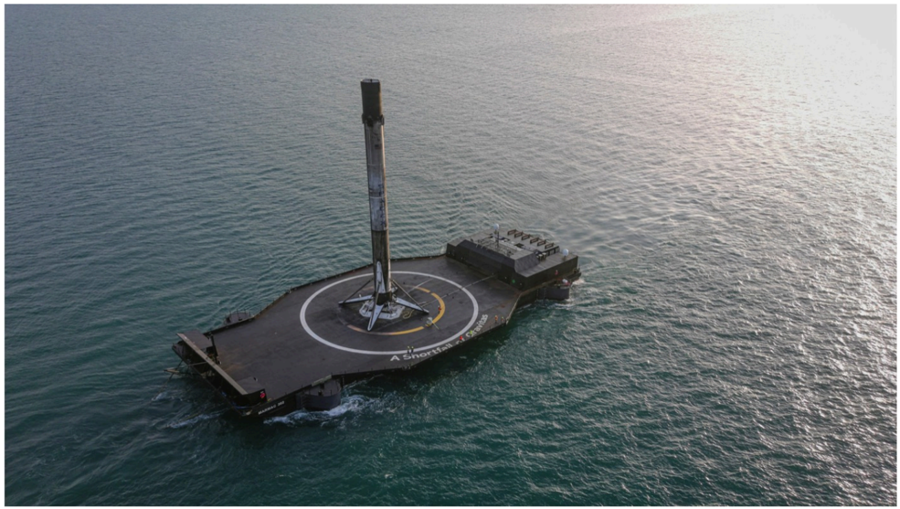

# f075 — SpaceX Falcon 9 booster landed on autonomous drone ship at sea

Aerial view of a SpaceX Falcon 9 first-stage booster successfully landed on an autonomous spaceport drone ship in the ocean, demonstrating reusable rocket recovery.

The photo is an aerial oblique shot showing a SpaceX autonomous spaceport drone ship positioned in open ocean. A Falcon 9 first-stage booster stands upright on the ship's deck after a landing, with its landing legs extended. The drone ship deck features a painted logo/marking. No axis or series applies; the image documents a rocket booster recovery event.

**Entities:** SpaceX, Falcon 9, autonomous spaceport drone ship, ASDS, rocket booster, reusable rocket, first stage recovery, drone ship

