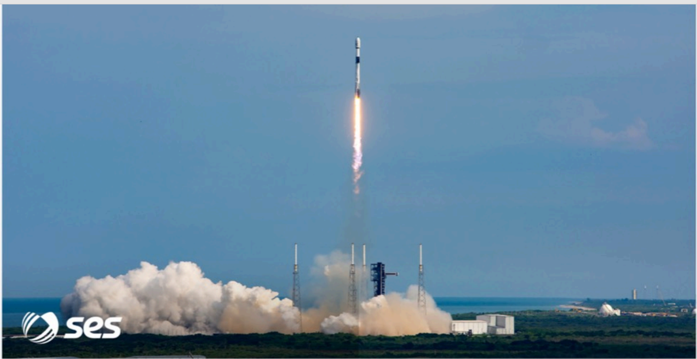

# f076 — SES Falcon 9 rocket launch photo at Cape Canaveral

A SpaceX Falcon 9 rocket lifts off from Cape Canaveral carrying an SES payload, illustrating SpaceX's commercial launch services for satellite operators.

The photograph captures a Falcon 9 rocket at the moment of liftoff, rising on a column of flame above billowing white exhaust clouds from the launch pad. The rocket is shown ascending nearly vertically against a blue sky, with launch tower structures visible on the right. The SES logo is overlaid in the lower-left corner, identifying the satellite operator as the mission customer. The scene depicts a typical commercial geostationary satellite launch from Florida's Space Coast.

**Entities:** SES, SpaceX, Falcon 9, Cape Canaveral, Falcon 9 launch, commercial launch, satellite launch, Space Coast, Florida

