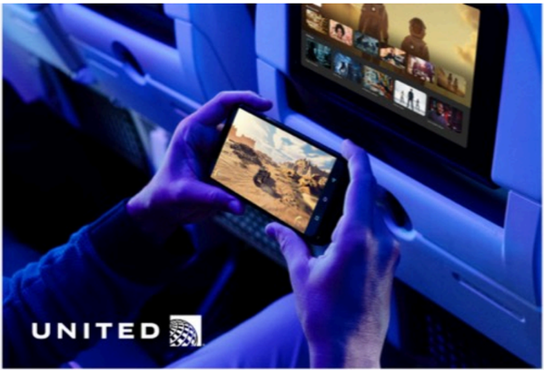

# f077 — United Airlines in-flight entertainment smartphone usage photo

A passenger aboard a United Airlines flight uses a smartphone to stream content while a seatback entertainment screen is visible in the background.

The photo shows a close-up of a passenger's hands holding a smartphone displaying a video game or action video in a darkened aircraft cabin bathed in blue ambient lighting. A seatback entertainment screen showing a colorful content grid is visible just behind the passenger. The United Airlines logo with its globe icon appears in the lower-left corner of the image. The image illustrates in-flight connectivity and entertainment use on United's aircraft.

**Entities:** United Airlines, United, in-flight entertainment, seatback screen, smartphone, streaming, WiFi, connectivity

