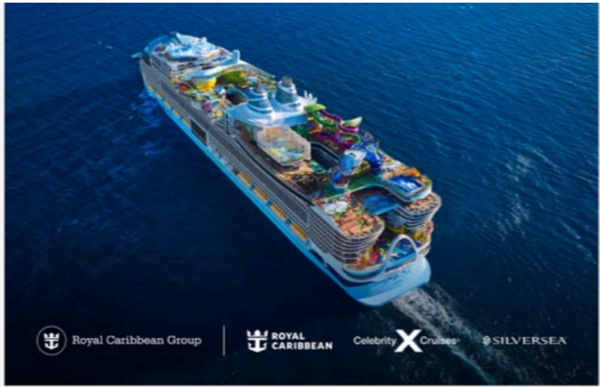

# f078 — Royal Caribbean Group cruise ship aerial photo with brand logos

Aerial view of a large Royal Caribbean cruise ship at sea, shown alongside the logos of Royal Caribbean Group's three brands: Royal Caribbean, Celebrity Cruises, and Silversea.

The image is an aerial photograph of a large, modern cruise ship sailing on blue water, viewed from above at a slight angle. The ship features colorful amenities visible on the upper decks. Below the ship photo, three brand logos are displayed side by side: Royal Caribbean Group (parent company), Royal Caribbean (main cruise line), and Celebrity Cruises and Silversea (subsidiary brands).

**Entities:** Royal Caribbean Group, Royal Caribbean, Celebrity Cruises, Silversea, cruise ship

