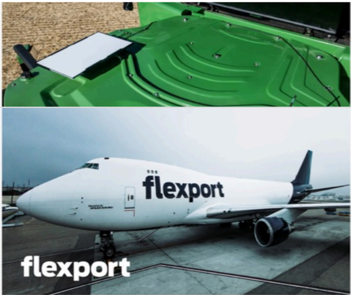

# f080 — Flexport cargo aircraft and container photo collage

The figure shows two photos associated with Flexport — a green shipping container (top) and a Flexport-branded cargo aircraft on the tarmac (bottom) — illustrating the company's physical freight and air cargo operations.

The top image shows a green intermodal shipping container viewed from above at an angle, displaying its roof hatches and corrugated surface. The bottom image shows a large white cargo aircraft (likely a Boeing 747 freighter) with 'flexport' painted in blue on the fuselage, parked on an airport ramp. A 'flexport' logo is overlaid in white text at the bottom-left corner of the composite image. Together the images represent Flexport's multimodal freight forwarding capabilities spanning sea/ground containers and air freight.

**Entities:** Flexport, cargo aircraft, Boeing 747, intermodal container, freight forwarding, air cargo, logistics

