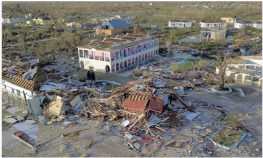

# f081 — Aerial photo of hurricane disaster destruction — devastated buildings

An aerial photograph showing catastrophic structural destruction from a hurricane or severe storm, with debris-strewn grounds and at least one partially standing building amid widespread ruin.

The image is an aerial/drone photograph taken from above looking down at a disaster-affected area. The scene shows extensive building destruction, with structures reduced to rubble and debris scattered across a wide area. One larger multi-story building with a reddish roof remains partially standing on the left side of the frame. The surrounding area is blanketed with structural debris, suggesting near-total destruction from a high-intensity storm event.

**Entities:** hurricane, disaster, aerial photography, storm damage, structural destruction, debris, Caribbean, tropical cyclone

