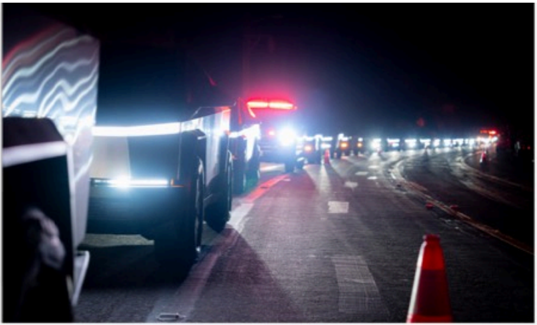

# f082 — Tesla Semi trucks convoy nighttime road photo

A nighttime photograph shows a line of Tesla Semi electric trucks queued on a road, illustrating fleet deployment or a convoy demonstration.

The image is a nighttime photograph taken from road level showing a convoy of large electric semi trucks, identifiable by their distinctive LED headlight and taillight strips, stretching into the distance. The road is lined with orange traffic cones on the right side, suggesting a controlled or staged environment. The scene is illuminated primarily by the vehicles' lights against a dark background, conveying scale and fleet readiness.

**Entities:** Tesla Semi, electric truck, convoy, fleet, LED headlights, traffic cones

