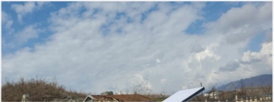

# f083 — Damaged building with collapsed roof — disaster scene photo

The image shows a structure with a heavily damaged or collapsed roof amid rubble and vegetation, suggesting aftermath of a natural disaster or severe storm.

The photograph depicts a low-lying building whose roof has visibly collapsed or been heavily damaged, with debris and bare vegetation surrounding the structure. A blue-and-white panel (possibly a solar panel or tarp) leans against the right side of the building. Mountains and a partly cloudy blue sky are visible in the background. The scene is consistent with earthquake or storm damage documentation.

**Entities:** damaged building, collapsed roof, solar panel, natural disaster, rubble, mountains

